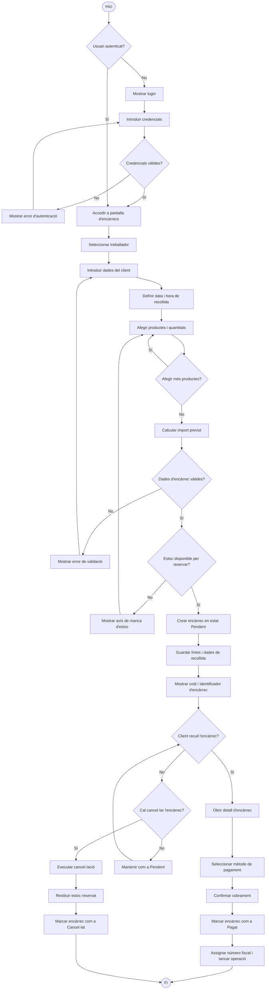

# Diagrama d'activitat d'encàrrec

Aquest diagrama representa el flux d'un encàrrec: creació, validacions, registre en estat pendent i resolució final mitjançant cobrament o cancel·lació.

```mermaid
flowchart TD
    A([Inici]) --> B{Usuari autenticat?}
    B -- No --> C[Mostrar login]
    C --> D[Introduir credencials]
    D --> E{Credencials vàlides?}
    E -- No --> F[Mostrar error d'autenticació]
    F --> D
    E -- Sí --> G[Accedir a pantalla d'encàrrecs]
    B -- Sí --> G

    G --> H[Seleccionar treballador]
    H --> I[Introduir dades del client]
    I --> J[Definir data i hora de recollida]
    J --> K[Afegir productes i quantitats]
    K --> L{Afegir més productes?}
    L -- Sí --> K
    L -- No --> M[Calcular import previst]

    M --> N{Dades d'encàrrec vàlides?}
    N -- No --> O[Mostrar error de validació]
    O --> I
    N -- Sí --> P{Estoc disponible per reservar?}
    P -- No --> Q[Mostrar avís de manca d'estoc]
    Q --> K
    P -- Sí --> R[Crear encàrrec en estat Pendent]
    R --> S[Guardar línies i dades de recollida]
    S --> T[Mostrar codi / identificador d'encàrrec]

    T --> U{Client recull l'encàrrec?}
    U -- Sí --> V[Obrir detall d'encàrrec]
    V --> W[Seleccionar mètode de pagament]
    W --> X[Confirmar cobrament]
    X --> Y[Marcar encàrrec com a Pagat]
    Y --> Z[Assignar número fiscal i tancar operació]
    Z --> AA([Fi])

    U -- No --> AB{Cal cancel·lar l'encàrrec?}
    AB -- No --> AC[Mantenir com a Pendent]
    AC --> U
    AB -- Sí --> AD[Executar cancel·lació]
    AD --> AE[Restituir estoc reservat]
    AE --> AF[Marcar encàrrec com a Cancel·lat]
    AF --> AA
```

