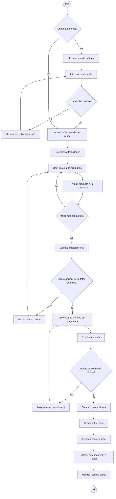

# Diagrama d'activitat de venda

Aquest diagrama representa el flux principal de venda directa (no encàrrec), incloent validacions de sessió, selecció de productes, comprovació d'estoc i tancament de cobrament.

