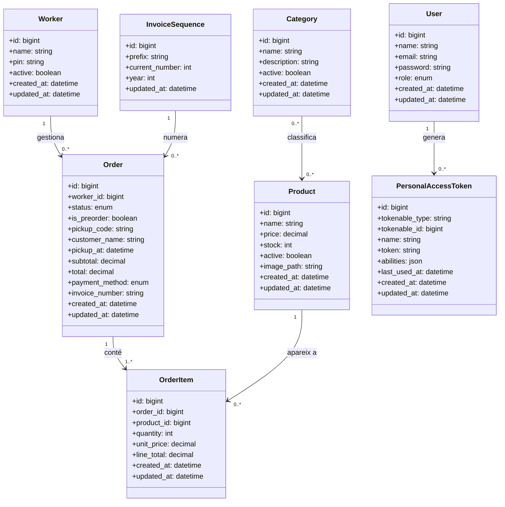

# Diagrama de classes principal

Aquest diagrama mostra les classes de domini principals de Quickserve i les seves relacions estructurals.

```mermaid
classDiagram
    class User {
      +id: bigint
      +name: string
      +email: string
      +password: string
      +role: enum
      +created_at: datetime
      +updated_at: datetime
    }

    class Worker {
      +id: bigint
      +name: string
      +pin: string
      +active: boolean
      +created_at: datetime
      +updated_at: datetime
    }

    class Category {
      +id: bigint
      +name: string
      +description: string
      +active: boolean
      +created_at: datetime
      +updated_at: datetime
    }

    class Product {
      +id: bigint
      +name: string
      +price: decimal
      +stock: int
      +active: boolean
      +image_path: string
      +created_at: datetime
      +updated_at: datetime
    }

    class Order {
      +id: bigint
      +worker_id: bigint
      +status: enum
      +is_preorder: boolean
      +pickup_code: string
      +customer_name: string
      +pickup_at: datetime
      +subtotal: decimal
      +total: decimal
      +payment_method: enum
      +invoice_number: string
      +created_at: datetime
      +updated_at: datetime
    }

    class OrderItem {
      +id: bigint
      +order_id: bigint
      +product_id: bigint
      +quantity: int
      +unit_price: decimal
      +line_total: decimal
      +created_at: datetime
      +updated_at: datetime
    }

    class InvoiceSequence {
      +id: bigint
      +prefix: string
      +current_number: int
      +year: int
      +updated_at: datetime
    }

    class PersonalAccessToken {
      +id: bigint
      +tokenable_type: string
      +tokenable_id: bigint
      +name: string
      +token: string
      +abilities: json
      +last_used_at: datetime
      +created_at: datetime
      +updated_at: datetime
    }

    User "1" --> "0..*" PersonalAccessToken : genera
    Worker "1" --> "0..*" Order : gestiona
    Order "1" --> "1..*" OrderItem : conté
    Product "1" --> "0..*" OrderItem : apareix a
    Category "0..*" --> "0..*" Product : classifica
    InvoiceSequence "1" --> "0..*" Order : numera
```

