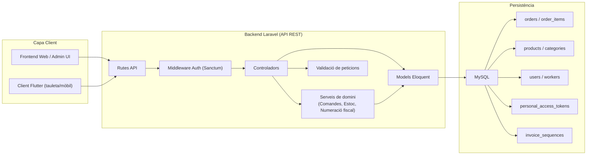

# Diagrama de components

Aquest diagrama representa els components principals de l'arquitectura de Quickserve i les seves dependències.

```mermaid
flowchart LR
    subgraph Clients["Capa Client"]
        Web["Frontend Web / Admin UI"]
        Flutter["Client Flutter (tauleta/mòbil)"]
    end

    subgraph API["Backend Laravel (API REST)"]
        Routes["Rutes API"]
        Middleware["Middleware Auth (Sanctum)"]
        Controllers["Controladors"]
        Services["Serveis de domini\n(Comandes, Estoc, Numeració fiscal)"]
        Validators["Validació de peticions"]
        Models["Models Eloquent"]
    end

    subgraph Data["Persistència"]
        MySQL["MySQL"]
        Orders["orders / order_items"]
        Catalog["products / categories"]
        Users["users / workers"]
        Tokens["personal_access_tokens"]
        Seq["invoice_sequences"]
    end

    Web --> Routes
    Flutter --> Routes

    Routes --> Middleware
    Middleware --> Controllers
    Controllers --> Validators
    Controllers --> Services
    Controllers --> Models
    Services --> Models

    Models --> MySQL
    MySQL --> Orders
    MySQL --> Catalog
    MySQL --> Users
    MySQL --> Tokens
    MySQL --> Seq
```

