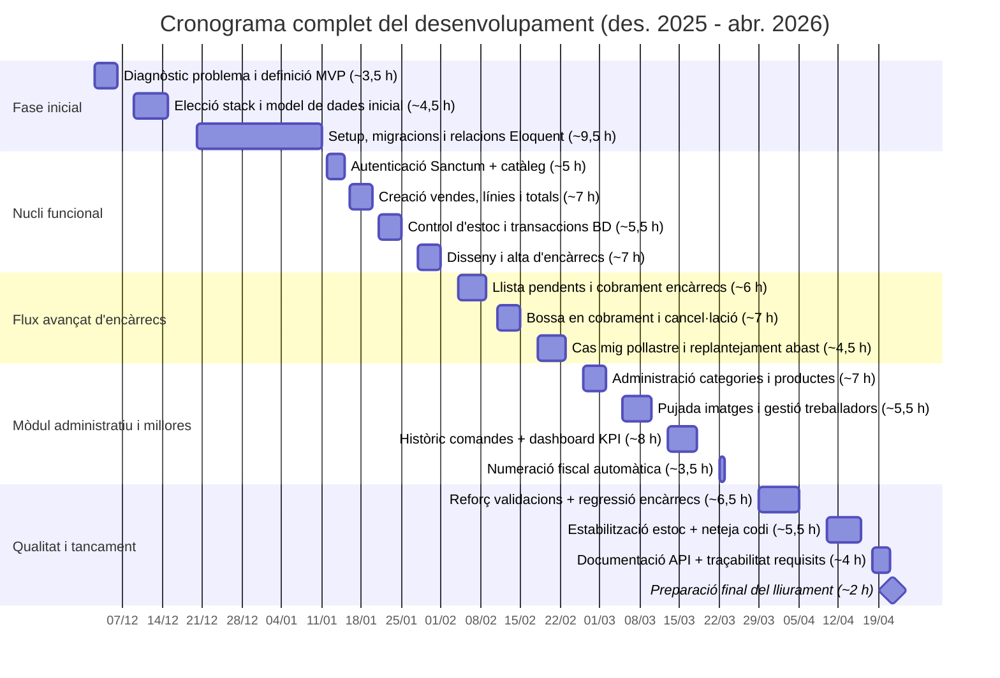

# Diagrama Gantt del projecte Quickserve

## Resum d'esforç

- Hores totals aproximades: **101,5 h**
- Període global: **2 desembre 2025 - 21 abril 2026**
- Estructura del cronograma: fase inicial, nucli funcional, flux avançat, administració i tancament

